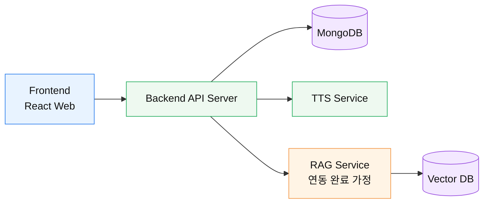

# Weekly 작성 가이드

## 0. 위클리는 무엇인가요?

위클리는 내가 하고 있는 일을 팀에 공유하고, 이번 주 업무 흐름을 함께 맞추는 시간입니다.

MAGO에서는 노션의 Team Space > Developers > Meetings에 위클리 문서를 작성합니다.

위클리 문서에는 내가 진행한 태스크, 완료한 일, 현재 진행 중인 일, 다음에 진행할 일을 정리합니다.

> 위클리의 목적은 보고를 위한 보고가 아니라, 팀이 같은 상황을 이해하고 다음 액션을 빠르게 정하는 것입니다.

## 프로젝트 아키텍처

## 1. 태스크 상태를 먼저 확인합니다

위클리는 태스크를 기준으로 작성하면 흐름을 잡기 쉽습니다. 먼저 이번 주에 공유할 태스크를 정하고, 실제 노션 태스크 페이지에서는 아래 항목이 빠지지 않았는지 확인합니다.

- 마감일은 반드시 설정합니다.
- 태스크 속성은 삭제하지 않습니다.
- `status`, `수식`, `Task Number`는 GitHub 연동에 사용되므로 그대로 유지합니다.
- 종료된 프로젝트의 태스크는 `status -> archive`로 변경합니다.
- Person에는 실제 담당자만 포함합니다.
- 확인이나 팔로업이 필요한 사람은 CC에 노션 이름으로 멘션합니다.
- 태스크 규모가 크다면 테스트와 마일스톤 기준으로 더 작게 나눕니다.

> 이 데모에서는 실제 태스크를 만들지는 않습니다. 어떤 태스크를 기준으로 위클리를 작성할지 정했다고 가정하고 다음 단계로 넘어갑니다.

## 2. 진행 상황을 공유합니다

내가 하고 있는 일을 멘션하고, 필요한 설명을 짧게 덧붙입니다. 태스크만으로 설명이 충분하면 추가 설명은 길게 적지 않아도 됩니다.

### @

@를 입력하면 내 이름을 멘션할 수 있습니다.

### 키워드

지금 하고 있는 일의 전체 흐름을 한 문장으로 적습니다.

### 완료한 사항

| Task | 설명 |
| --- | --- |
| 예: API 응답 구조 정리 | 프론트에서 필요한 필드를 기준으로 응답 형식을 맞췄습니다. |

### 현재 진행 중인 사항

| Task | 설명 |
| --- | --- |
| 예: 위클리 화면 연결 | 목요일 위클리 항목에서 상세 가이드로 이동하도록 연결 중입니다. |

### 다음에 진행할 사항

| Task | 설명 |
| --- | --- |
| 예: 테스트 보완 | 데모 시나리오 기준으로 화면 이동과 TTS 흐름을 점검합니다. |

> 공유할 게 있어요: 팀에서 함께 알아야 할 변경사항이나 결정 사항을 적습니다.

> 어려움을 겪고 있어요: 막힌 점, 도움이 필요한 부분, 판단이 필요한 내용을 적습니다.

## 3. 논의사항과 공지사항을 정리합니다

- 추가 논의가 필요한 내용은 자유롭게 작성합니다.
- 공지사항은 관련자가 바로 이해할 수 있도록 짧게 적습니다.
- 태스크로 관리해야 하는 내용은 가능하면 태스크와 연결합니다.
